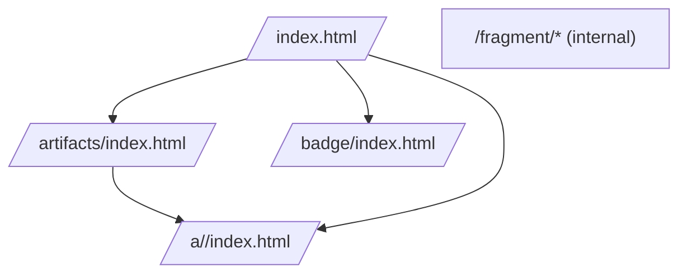

# Frontend Meta Plan — Provenance SSG (v1)

This meta plan defines the front-end information architecture, page catalogue, global layout (top bar, side bar, content, footer), component inventory, and content blueprints for the Provenance static site, aligning with the repository specs.

Sources of truth used:

- `/.specs/00_provenance.md` (artifact-first contract)
- `/.specs/10_proofdown.md` (Proofdown)
- `/.specs/40_accessibility.md` (a11y baseline)
- `crates/frontend/.docs/SITE_DESIGN.md`

Goals:

- Deterministic, secure, accessible static UI.
- Minimal surface area, pure server-side rendering (strings) via RSX components used by `provenance_ssg`.
- Clear IA: home KPIs, artifacts browsing, artifact details, badges, Proofdown front page.

---

## 1) Information Architecture (IA) and Routes

Canonical static routes (no client routing):

- `/index.html` — Home (overview KPIs + optional Proofdown section)
- `/artifacts/index.html` — Artifacts index, search/filter/sort
- `/a/<artifact-id>/index.html` — Artifact detail
- `/badge/index.html` — Badge documentation (JSON/SVG examples and schema links)
- `/badge/*.json` + `/badge/*.svg` — Badge assets (generated)
- `/assets/<artifact-id>/<filename>` — Verified downloads
- `/fragment/*` — Fragment endpoints for large bodies (private, robots disallowed)
- `/404.html` — Not found

Sitemap (mermaid):



Deterministic ordering:

- Artifact lists sorted by `id` (stable).
- Coverage tables sorted by path.
- Props normalized before render.

---

## 2) Global Layout

Structure per page:

- Skip link: `#skip-to-content`
- Header (Top Bar): brand/title, primary nav, search entry, theme toggle, commit info
- Main: optional Side Bar + Content
- Footer: links to repo/specs, version, license, robots

Breakpoints (reference):

- Mobile: < 640px — stacked, Side Bar collapsible (toggle button in Top Bar)
- Tablet: 640–1024px — Side Bar accordion; content max-width container
- Desktop: ≥ 1024px — Side Bar visible when present; content in a grid

Accessibility (baseline):

- Landmarks: `<header>`, `<nav>`, `<main>`, `<footer>`.
- Breadcrumbs with `nav[aria-label="Breadcrumb"]` on detail pages.
- Keyboard access: focusable controls, visible focus rings.

---

## 3) Top Bar (Header)

Contents and behavior:

- Brand/Title: site title or `front_page.title`.
- Primary nav items (left-to-right):
  - Home (`/`)
  - Artifacts (`/artifacts/`)
  - Proofdown (anchor to front-page section or `/` if embedded)
  - Badges (`/badge/`)
- Search entry:
  - Default (v1, no-JS baseline): Top Bar search icon links to `/artifacts/#search` and focuses the search input on that page (keyboard `/` can be implemented with progressive enhancement when JS is enabled).
  - Optional (feature-gated): client-side search modal over a static index JSON; requires relaxing CSP for the search script (off by default).
- Theme toggle: Light/Dark/System; persists to `localStorage` and uses `data-theme` on `<html>`.
- Commit info: short SHA with link to repo/commit (from manifest); static anchor only.

Determinism & CSP:

- CSP default: `script-src 'none'`; no JS required for core navigation.
- Search modal is an optional enhancement behind a feature flag that adjusts CSP via SSG configuration; keep default off in v1.

---

## 4) Side Bar (Left/Right Asides)

Side Bar usage varies by page:

- Home: no side bar by default; Proofdown can include internal ToC as a right aside if present.
- Artifacts index:
  - Left Side Bar: filters (facets) + quick sort; sticky on desktop; collapsible drawer on mobile.
- Artifact detail:
  - Left Side Bar: navigation (back to index, groups/sections if present, previous/next by sorted order).
  - Right Aside: metadata (id, media_type, size if available, sha256 with copy).

Accessibility:

- Side Bar toggle button announced to screen readers; ESC closes drawer.
- Filters use native controls with labels.

---

## 5) Page Blueprints (Content)

### 5.1 Home `/`

- H1: site title (`front_page.title`) and commit.
- KPI cards: derived from `summary:test` artifact.
- Featured artifacts: grid of cards (configurable by manifest/grouping; otherwise top N by heuristic).
- Proofdown front section (if enabled via manifest `front_page.markup`):
  - Render with whitelisted components.
  - Markdown text uses CommonMark/GFM subset; raw HTML is escaped.

### 5.2 Artifacts Index `/artifacts/`

- H1: Artifacts.
- Faceted filters (Left Side Bar):
  - Render kind: `summary:test`, `table:coverage`, `markdown`, `json`, `image`, `repo:*`.
  - Verification status: verified/error.
  - Media type family: `text/*`, `image/*`, `application/json`.
- Search input: filters by `id`, `title`, `render`, `media_type`.
- Sort control: `id` (default), `title`, `render`.
- Results: cards/table rows with `id`, `title`, render type, verification badge, link.
- Empty state: helpful message.

### 5.3 Artifact Detail `/a/<id>/`

- Breadcrumbs: Home / <Artifact Title>.
- Header: title, `id` (subtext), verified badge (or error banner).
- Primary actions: Verified Download link (exact bytes), Copy SHA-256.
- Body: rendered by viewer mapped from `render` + `media_type`:
  - `summary:test` → KPI summary
  - `table:coverage` → sortable table
  - `markdown` → sanitized HTML
  - `json` → collapsible tree (no-JS baseline: pretty JSON with limited collapsible via `<details>`)
  - `image` → responsive `` with alt
  - Unknown → safe generic viewer or error message
- Truncation banner for large content with verified Download link.

### 5.4 Badges `/badge/`

- Explain JSON and SVG variants; link to `schemas/badge.schema.json`.
- Show current badges derived from verified inputs.
- Document error states and thresholds.

### 5.5 Error/Utility Pages

- 404 Not Found with link back home.
- Verification failure banners inline on affected pages.

---

## 6) Component Inventory (RSX)

Layout & Navigation:

- `Layout { title, commit, theme, top_nav: Vec<NavItem>, show_sidebar: bool, sidebar: Option<Node>, right_aside: Option<Node>, children }`
- `TopNav { items: Vec<NavItem>, theme_toggle: bool, show_search: bool, commit: Option<CommitInfo> }`
- `Breadcrumbs { trail: Vec<Breadcrumb> }`
- `SideBar { sections: Vec<SideSection> }`
- `Footer { links: Vec<Link>, repo, version }`

Home & KPIs:

- `KpiCards { total, passed, failed, duration_seconds }`
- `Card { title, children }`
- `FeaturedArtifacts { items: Vec<ArtifactCardProps> }`
- `ArtifactCard { id, title, verified: bool, href, kind }`

Artifacts Index:

- `ArtifactFilters { kinds: Vec<Kind>, verification: Vec<Status>, media_types: Vec<Family>, selected: Filters }`
- `ArtifactList { items: Vec<ArtifactRow>, sort: SortKey }`
- `SearchBox { value }` (no-JS baseline; submits to on-page filter)

Artifact Detail:

- `ArtifactPage { header: ArtifactHeader, verified: bool, download_href, sha256, body_html }`
- `MetadataList { entries: Vec<(key, value)> }`

Viewers (bridge to `renderers` crate):

- `MarkdownViewer { html }`
- `JsonViewer { json, collapsed_default: bool, depth: u8 }`
- `CoverageTable { rows, total_pct }`
- `TestSummary { total, passed, failed, duration_seconds }`
- `ImageViewer { src, alt, max_height }`

Proofdown Widgets (wrappers):

- `PmlGrid { cols, gap, children }`
- `PmlCard { title, children }`
- `PmlArtifactEmbed { kind, id }` (delegates to viewers)

Badges:

- `Badge { kind: pass|fail|warn|info, text }`

Helpers:

- `VerificationBadge { state }`
- `TruncationNotice { limit_label, download_href }`

Exports (string renderers):

- `render_index(props) -> String`
- `render_artifacts_index(props) -> String`
- `render_artifact(props) -> String`
  (Note: Proofdown AST→HTML is produced by the external `crates/proofdown_renderer` submodule; the frontend only embeds the resulting HTML fragment.)

---

## 7) Theming and CSS

- CSS variables for tokens: `--bg`, `--fg`, `--muted`, `--card-bg`, `--ok`, `--warn`, `--err`.
- Themes: `light`, `dark`, `system` via `data-theme` attribute on `<html>`.
- Inline minimal CSS in v1 (keeps SSG simple). v1.1: extract to asset and link.
- Focus and hover states accessible (WCAG AA contrast).
- System fonts only (determinism; no external fetches).

---

## 8) Security & Determinism

- No raw HTML execution; all text sanitized. Proofdown: raw HTML is escaped.
- CSP baseline: `script-src 'none'`; no client JS required for core flows.
- Optional JS (search modal) is feature-gated; defaults off.
- Sorting: all collections pre-sorted by `id` or stable keys.
- No timestamps or non-deterministic values in output.

---

## 9) Performance

- Minify CSS (optional `xtask` with `lightningcss`).
- Brotli/Gzip by host (Cloudflare) when deployed.
- Avoid large inline JSON; truncate with download links.
- Fragment routes for heavy viewers.

---

## 10) Accessibility Checklist (per page)

- Home: single `<h1>`, semantic section headings; card titles are headings.
- Index: table semantics and sortable column announcements; filter controls labelled.
- Detail: alt text for images; JSON collapsers via `<details>` for no-JS baseline.
- Keyboard: tab order logical; visible focus; ESC to close Side Bar drawer.

---

## 11) Page Props (Public API surface)

High-level props passed from `provenance_ssg` (illustrative types):

```rust
pub struct CommitInfo { pub sha_short: String, pub url: Option<String> }
pub struct Kpis { pub total: u32, pub passed: u32, pub failed: u32, pub duration_seconds: f32 }

pub struct IndexPageProps {
    pub title: String,
    pub commit: Option<CommitInfo>,
    pub kpis: Option<Kpis>,
    pub featured: Vec<ArtifactCardProps>,
    pub proofdown_html: Option<String>,
}

pub struct ArtifactsIndexProps {
    pub items: Vec<ArtifactRow>,
    pub filters: Filters,
    pub sort: SortKey,
}

pub struct ArtifactPageProps {
    pub id: String,
    pub title: String,
    pub verified: bool,
    pub sha256: String,
    pub media_type: String,
    pub download_href: String,
    pub body_html: String,
    pub prev_next: Option<(String, String)>,
}
```

All inputs are sanitized/escaped as needed before RSX render.

---

## 12) Implementation Phases (focused on UI)

- Phase 1: Core layout + pages
  - Implement `Layout`, `TopNav`, `KpiCards`, `ArtifactPage`.
  - Wire `provenance_ssg` to call `render_index`, `render_artifact`, `render_artifacts_index`.
- Phase 2: Artifacts index + filters
  - Build Side Bar filters and search input (no-JS baseline), sorting.
- Phase 3: Proofdown section
  - Embed HTML fragment returned by `proofdown_renderer`; provide consistent CSS classes and layout wrappers around the fragment as needed.
- Phase 4: Theming
  - CSS variables, theme toggle, persistence.
- Phase 5: Optional enhancements
  - Feature-gated search modal (JS), extracted CSS asset.

Acceptance gates:

- `cargo build --workspace` green, `cargo fmt` + `clippy -D warnings`.
- Deterministic output: repeated SSG runs produce byte-identical HTML given same inputs.
- Basic a11y checks on `/` and one detail page pass.

---

## 13) Open Questions

- Keep inline CSS in v1 or extract now?
- Proofdown: TOC placement (right aside vs in-flow)?
- Should index filters be persisted via URL query params for deep linking?
- Are multi-manifest (multi-repo) views in scope for v1?

---

## 14) Notes

- Proofdown Markdown uses CommonMark/GFM subset; raw HTML is escaped (not rendered).
- External submodule `crates/proofdown_parser` is not modified here; we integrate via feature-gated interfaces.
- No network fetches in renderers; all resources originate from the verified manifest.
